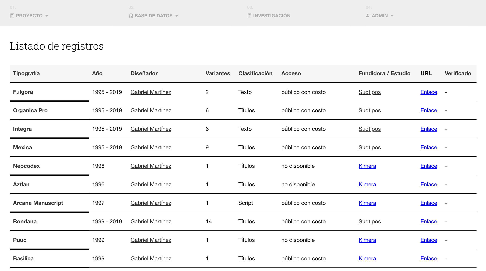
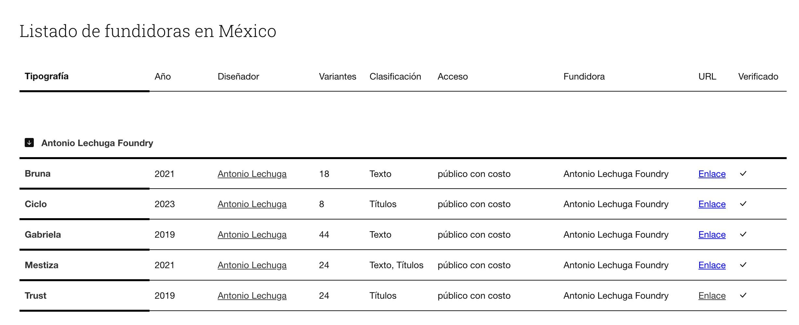
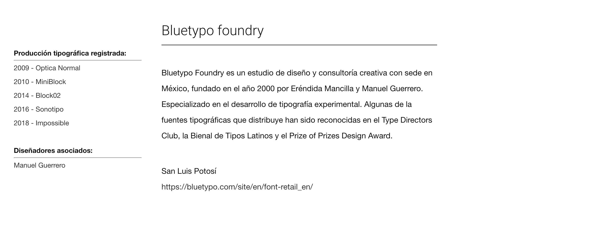
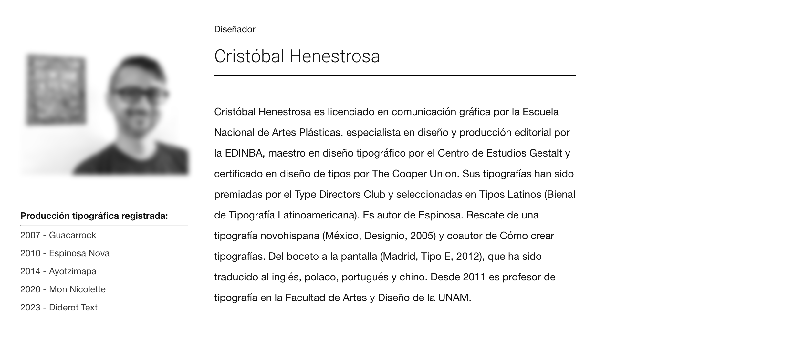

# TipoData_mx

## Description

This project aims to comprehensively and meticulously address the analysis of Mexican typographic production over a period of 25 years. The inherent complexity of typographic evolution requires a systematic approach, and our exhaustive mapping methods will provide a faithful and detailed representation of the multiple facets that make up this field.

Identifying trends will delve into conceptual and contextual aspects, considering the interaction with socioeconomic, technological, and cultural factors that may have influenced their development.

This repository contains files that constitute the indexing system of the Mexican typographic production to the database for its subsequent analysis.

## Features

- **Database Management**: Efficient handling and organization of large datasets related to Mexican typography.
- **User Authentication**: Secure login and role-based access control for managing user permissions.
- **Foundry Registration**: Allows editors to register and manage typographic foundries.
- **Trend Analysis (WIP)**: Tools for analyzing typographic trends over the past 25 years, considering various influencing factors.
- **Interactive Interface (WIP)**: User-friendly interface for querying and visualizing typographic data.

## Usage

1. Clone this repository to your local machine using git clone.
2. Set up your local development environment with PHP and a MySQL database.
3. Import the SQL files to create the necessary database tables.
4. Use the provided PHP scripts to interact with the database and manage the typographic data.

## Examples

*Interface fonts list. Example 1*

*Interface Mx Foundries. Example 2*

*Interface Foundrie description. Example 3*

*Interface User profile. Example 4*

## Credits

This project was created by Manuel Guerrero and is open for contributions and collaborations. Visit the website at [vanguardiasdiseno.org](https://vanguardiasdiseno.org/site/archivos/326).

## License

This project is licensed under the [GPL-3.0 license](LICENSE).

## Contributing

Contributions are welcome! Feel free to open issues or pull requests for any improvements or suggestions.

## Cite this project
Download the file [BibTeX file](ref_DBTipoMx.bib) or copy this:

@misc{database2024,
  author       = {Manuel Guerrero and Erendida Mancilla},
  title        = {Database of Mexican Typographic Production},
  year         = {2024},
  organization = {UASLP}
}

## Acknowledgments

Special thanks to the Typography community (AMT) Mexican Association of Typography for their support and resources to create this database.
